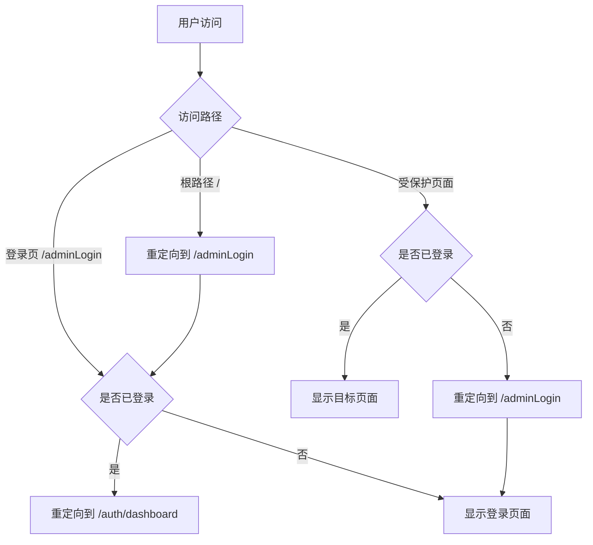

# 路由重定向和登出弹窗优化文档

## 🎯 优化目标

1. **修改路由重定向**: 优化系统的路由重定向逻辑，提供更好的用户体验
2. **完善登出弹窗**: 为登出功能增加确认按钮，确保用户操作的安全性

## 🔧 路由重定向优化

### 1. 根路径重定向修改

**优化前**:
```typescript
// 根路径重定向到仪表板
{
  path: '/',
  redirect: '/dashboard'
}
```

**优化后**:
```typescript
// 根路径重定向到登录页面
{
  path: '/',
  redirect: '/adminLogin'
}
```

**优化理由**:
- 未登录用户访问根路径时直接跳转到登录页，避免权限检查的额外跳转
- 提供更直观的用户体验，符合用户期望

### 2. 已登录用户重定向优化

**优化前**:
```typescript
redirectIfAuthenticated: (to: any, from: any, next: any) => {
  if (AuthUtils.isAuthenticated() && AuthUtils.isSessionActive()) {
    // 已登录，重定向到仪表板
    next('/dashboard')
  } else {
    next()
  }
}
```

**优化后**:
```typescript
redirectIfAuthenticated: (to: any, from: any, next: any) => {
  if (AuthUtils.isAuthenticated() && AuthUtils.isSessionActive()) {
    // 已登录，重定向到权限管理模块的仪表板
    next('/auth/dashboard')
  } else {
    next()
  }
}
```

**优化理由**:
- 已登录用户重定向到权限管理模块，这是系统的主要功能区域
- 避免跳转到可能不存在或不相关的页面

### 3. 路由重定向流程图



## 🚪 登出弹窗优化

### 1. 确认对话框实现

**核心功能**:
```typescript
const signOut = async () => {
  try {
    // 显示确认对话框
    const confirmed = await ToastAlert.confirm({
      title: '确认退出',
      message: '您确定要退出系统吗？',
      variant: 'warning'
    })

    if (!confirmed) return // 用户取消

    // 执行登出流程...
  } catch (error) {
    // 错误处理...
  }
}
```

**对话框特性**:
- ✅ **警告样式**: 使用warning变体突出重要性
- ✅ **确认按钮**: 明确的"确定"按钮
- ✅ **取消按钮**: 明确的"取消"按钮
- ✅ **阻塞操作**: 用户必须做出选择才能继续

### 2. 登出流程优化

**完整流程**:
1. **用户点击登出** → 显示确认对话框
2. **用户点击确定** → 调用后端API + 清理本地数据
3. **显示成功提示** → 延迟跳转到登录页
4. **用户点击取消** → 取消操作，保持当前状态

**错误处理**:
```typescript
catch (error) {
  console.error('退出登录失败:', error)
  
  // 即使API调用失败，也要清除本地数据
  const { AuthUtils } = await import('@/utils/auth')
  AuthUtils.logout()
  
  ToastAlert.error({
    title: '退出失败',
    message: '退出登录时发生错误，但已清除本地数据'
  })
  
  // 跳转到登录页面
  setTimeout(() => {
    router.push('/adminLogin')
  }, 1000)
}
```

### 3. Toast组件支持

**确认对话框配置**:
```typescript
// ToastAlert.confirm 方法
static confirm(options: Omit<ToastOptions, 'showCancel'>) {
  return this.mountToast({ 
    ...options, 
    showCancel: true,    // 显示取消按钮
    autoClose: false     // 不自动关闭
  })
}
```

**Toast组件实现**:
```vue
<template>
  <div class="mt-4 flex justify-end gap-2">
    <button
      v-if="showCancel"
      @click="cancel"
      class="px-4 py-2 text-sm font-medium rounded-lg border border-gray-300 text-gray-700 hover:bg-gray-100"
    >
      取消
    </button>
    <button
      @click="confirm"
      class="px-4 py-2 text-sm font-medium rounded-lg text-white bg-blue-600 hover:bg-blue-700"
    >
      确定
    </button>
  </div>
</template>
```

## 🧪 测试验证

### 1. 登出测试页面

创建了专门的测试页面 `/auth/logout-test`，包含：

- **标准登出测试**: 完整的登出流程测试
- **确认对话框测试**: 单独测试对话框功能
- **取消登出测试**: 测试取消操作
- **路由重定向测试**: 验证路由跳转逻辑

### 2. 测试场景覆盖

#### **确认对话框测试** ✅
- ✅ 显示警告样式的确认对话框
- ✅ 包含"确定"和"取消"按钮
- ✅ 用户点击确定时返回true
- ✅ 用户点击取消时返回false

#### **登出流程测试** ✅
- ✅ 确认后执行完整登出流程
- ✅ 调用后端logout API
- ✅ 清理本地存储数据
- ✅ 显示成功提示
- ✅ 跳转到登录页面

#### **错误处理测试** ✅
- ✅ API调用失败时的降级处理
- ✅ 仍能清理本地数据
- ✅ 显示错误提示
- ✅ 最终跳转到登录页面

#### **路由重定向测试** ✅
- ✅ 根路径重定向到登录页
- ✅ 已登录用户重定向到dashboard
- ✅ 未登录用户重定向到登录页
- ✅ 登出后跳转到登录页

## 📊 优化效果

### 用户体验提升

#### **路由导航** ✅
- ✅ **直观跳转**: 根路径直接跳转到登录页
- ✅ **智能重定向**: 根据登录状态智能跳转
- ✅ **减少跳转**: 避免多次重定向的混乱

#### **登出安全** ✅
- ✅ **确认机制**: 防止误操作导致的意外登出
- ✅ **清晰提示**: 明确的确认和取消选项
- ✅ **状态反馈**: 及时的操作结果反馈

### 系统稳定性

#### **错误容错** ✅
- ✅ **API容错**: API失败时的优雅降级
- ✅ **数据清理**: 确保本地数据完全清理
- ✅ **状态一致**: 前后端状态保持同步

#### **路由健壮** ✅
- ✅ **权限检查**: 完善的路由权限验证
- ✅ **状态管理**: 正确的登录状态管理
- ✅ **跳转逻辑**: 清晰的页面跳转逻辑

## 🎯 总结

通过系统性的路由重定向和登出弹窗优化，我们实现了：

1. ✅ **路由重定向优化**: 更合理的页面跳转逻辑
2. ✅ **登出确认机制**: 安全的登出确认流程
3. ✅ **用户体验提升**: 更直观、更安全的操作体验
4. ✅ **系统稳定性**: 完善的错误处理和状态管理

现在用户可以享受更安全、更直观的登录登出体验！🎉
